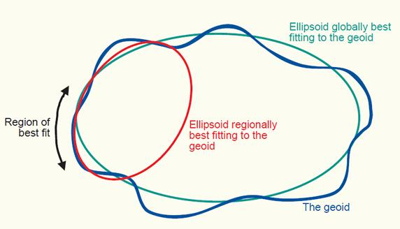
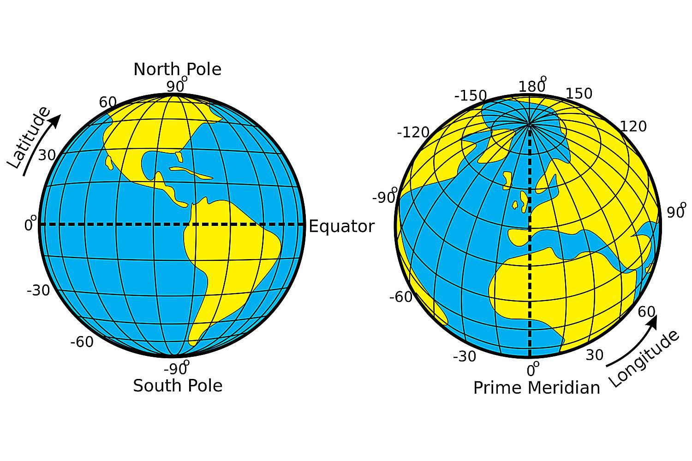
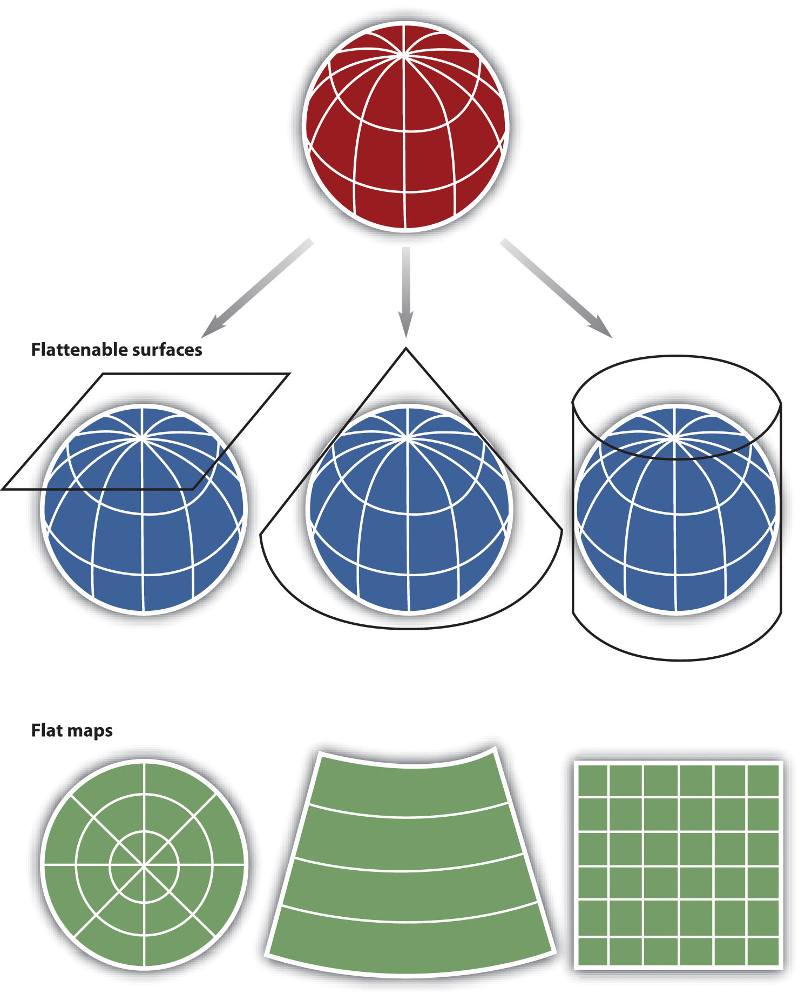
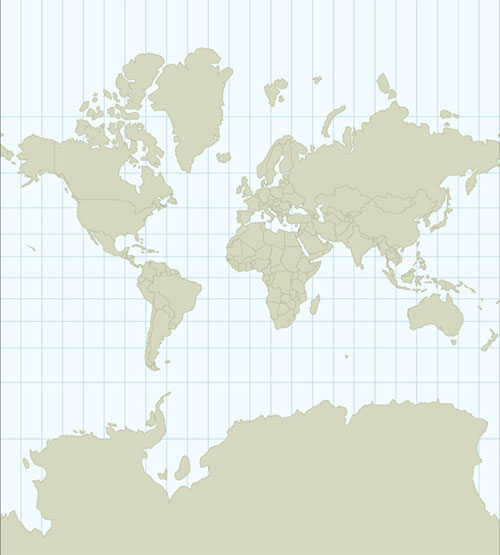
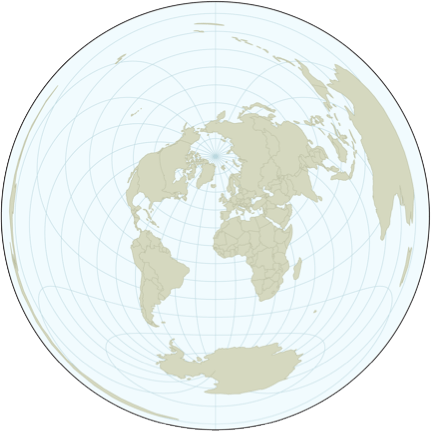
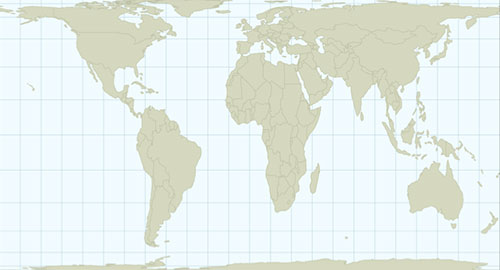
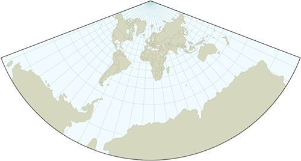

A fundamental aspect of spatial data is defining its Coordinate Reference System (CRS). A CRS defines how coordinates relate to actual locations on the Earth's surface. Without a CRS, coordinates are just numbers — a latitude of 65 and a longitude of -18 mean nothing unless we know *which* CRS they are expressed in.

A CRS is built from three components: an *ellipsoid*, a *datum*, and a *projection*.

---

# The components of a CRS

## Ellipsoid

The Earth is not a perfect sphere — it bulges at the equator and is flattened at the poles, and its surface is irregular. An **ellipsoid** is a smooth mathematical model that approximates the Earth's shape.

Some ellipsoids are fitted globally, trying to minimise error across the whole planet. **WGS84** is the most widely used global ellipsoid — it underpins GPS and most modern datasets. **GRS80** is nearly identical and underlies many national systems.

Local ellipsoids are fitted to a specific region and can be more accurate there. Examples include ED50 (fitted to Europe) and OSGB36 (Great Britain). You may encounter these in older national datasets.



## Datum

The **datum** anchors the ellipsoid to the actual surface of the Earth by defining an origin point and the orientation of the coordinate axes. The datum always specifies which ellipsoid it uses, and sometimes shares its name (e.g. WGS84 is both an ellipsoid and a datum).

Importantly, the same latitude/longitude values can refer to *different physical locations* depending on which datum is used. For most marine science work the differences are small enough to ignore, but they matter for precise navigation or cadastral work.

When the datum is unknown, it is generally safe to assume WGS84.

## Projection

Finally, the **projection** specifies how we represent the curved surface of the Earth on a flat plane. There are two broad approaches:

**a) Geographic coordinates (unprojected):** Latitude and longitude are spherical coordinates that describe positions on the 3D ellipsoid. When plotted directly on screen, they are treated as Cartesian (x, y) pairs — this is an implicit Equidistant Cylindrical projection and is fine for many purposes but distorts distances and areas, especially at high latitudes.

```{r out.width = "70%", echo=FALSE}

```

**b) Projected coordinates:** An explicit mathematical transformation converts spherical coordinates into planar (Cartesian) coordinates in metres (or feet). Projected CRS are essential for accurate distance and area calculations, and for geometric operations.

---

# Spatial projections

Different combinations of ellipsoid, datum, and transformation produce many different projections, broadly classified as planar (azimuthal), conical, or cylindrical.



All projections introduce distortions — no flat map can perfectly represent a curved surface. The key properties that projections trade off against each other are:

- **Area** (equal-area projections preserve area)
- **Shape** (conformal projections preserve local shape)
- **Distance** (equidistant projections preserve distances from a reference point)

A projection cannot preserve all three simultaneously.

The **Mercator** projection is conformal (preserves shapes locally) but greatly exaggerates areas near the poles. Greenland appears similar in size to South America, but in reality South America is about eight times larger. Mercator is well-suited for navigation because straight lines on the map are lines of constant bearing (rhumb lines).



The **Azimuthal Equidistant** projection preserves distances to and from the centre of the projection, but distorts shapes away from the centre.



The **Cylindrical Equal Area** projection preserves area — the proportions of Greenland and South America are correct — but distorts shapes near the poles.



**Conformal projections** (like the Lambert Conformal Conic) preserve local shapes across the map, making them good for general-purpose mapping of mid-latitude regions.



---

# Which projection to use?

There is no single right answer — projections have different properties suited to different purposes. The key questions to ask are:

**1. What geographic scale am I working at?**

- Global or hemispheric: use a projection designed for large extents (Mollweide, Robinson, Winkel Tripel for display; Equal Earth for thematic maps).
- Regional (e.g. Icelandic waters, the North Atlantic): use a projection centred on your study area. Lambert Azimuthal Equal Area (LAEA) centred on your region is a robust choice for most analytical work.
- National: use the official national projection if one exists. Iceland's official system is **ISN2016** (EPSG:8088), a LAEA projection using the GRS1980 ellipsoid, centred on Iceland.

**2. What property do I need to preserve?**

- **Area measurements or density maps** (points per grid cell, biomass per km²): use an **equal-area** projection. LAEA centred on your study area is a good default.
- **Shape and general mapping**: use a **conformal** projection such as Lambert Conformal Conic (LCC). Transverse Mercator (the basis of UTM) is conformal and widely used.
- **Distance from a central point**: use an **equidistant** projection (AEQD).
- **Polar regions**: use a **Stereographic** projection (e.g. EPSG:3995 for Arctic, EPSG:3031 for Antarctic), but note that area and distance are distorted away from the pole.

**3. Am I doing geometric calculations?**

Always use a **projected CRS** (not geographic lat/lon) for geometric operations like area calculations, buffering, and polygon overlays. The sf package will warn you when you run operations on unprojected data.

::: {.callout-tip}
## Useful tools for choosing a CRS
- <https://epsg.io> — search for CRS by name, location, or code
- <https://projectionwizard.org> — suggests projections based on the extent and purpose of your map
- The `crsuggest` package in R — suggests appropriate CRS options for an sf object based on its geographic extent (see below)
:::

...or choose based on your personality: <https://xkcd.com/977/>

---

# CRS in R

The **sf** package links to the external **PROJ** library (<https://proj.org/>) for all CRS operations. Modern versions of PROJ (6+) and sf use **WKT2** (Well-Known Text, 2nd edition) as the standard internal representation of CRS. This is more complete and less ambiguous than the older proj4string format.

## How to specify a CRS

There are two main ways to specify a CRS in sf:

**1. EPSG codes** — the preferred approach for common CRS. These are integer codes from the EPSG Geodetic Parameter Dataset that identify a specific CRS unambiguously.  You can refer to them just by their number, but it is better to use the full "authority:code" notation.  

```{r}
# EPSG:4326  — geographic coordinates, WGS84 (the GPS standard)
# EPSG:32628 — UTM zone 28N, WGS84
# EPSG:3035  — ETRS89-LAEA, the standard equal-area CRS for Europe
# EPSG:8088  — ISN2016 / LAEA Iceland (Iceland's official CRS)
# 8088  — same as above, but it is better to use the full notation
# ESRI:54009  — Mollweide projection — only exists in the ESRI registry, not EPSG

```

**2. Proj4 strings** (legacy) — strings like `"+proj=longlat +datum=WGS84"`. These still work for basic cases but are deprecated in modern PROJ. They cannot represent all CRS parameters and may produce warnings. You will encounter them in older code and documentation; prefer EPSG codes for new work.

## Querying the CRS of an object

```{r}
library(rnaturalearth)
library(tidyverse)
library(sf)

iceland <- ne_countries(returnclass = "sf", country = "Iceland", scale = 10) |>
  st_geometry()

st_crs(iceland)        # Full CRS information (WKT2 representation)
st_crs(iceland)$epsg   # Just the EPSG code
st_crs(iceland)$Name   # Human-readable name
st_is_longlat(iceland) # Is it geographic (unprojected)?
```

## Setting vs. transforming: a critical distinction

There are two very different operations that both involve CRS, and confusing them is one of the most common mistakes in spatial analysis:

::: {.callout-important}
## Setting a CRS vs. transforming a CRS

**Setting** (`st_set_crs()`) tells R what coordinate system the data is *already in*. It only changes the metadata — the coordinate values themselves do not change. Use this when you have data without CRS information attached.

**Transforming** (`st_transform()`) actually *recalculates* all coordinates from one CRS to another. Use this when you want to change the projection.

Applying `st_set_crs()` to data that is already correctly tagged will produce a warning and give wrong results. Applying `st_transform()` to data with no CRS will fail.
:::

```{r}
# Creating an sf object without a CRS
mysf <- data.frame(lat = c(66, 65.5), lon = c(-20, -19)) |>
  st_as_sf(coords = c("lon", "lat"))

st_crs(mysf) # NA — no CRS defined

# STEP 1: Set the CRS (we know these are WGS84 lat/lon)
mysf <- mysf |>
  st_set_crs(4326)

st_crs(mysf)$Name # Now it has a CRS

# STEP 2: Transform to a projected CRS (LAEA Iceland)
mysf_projected <- mysf |>
  st_transform(8088)

st_crs(mysf_projected)$Name
st_is_longlat(mysf_projected) # FALSE — now it's projected
```

Calling `st_set_crs()` on an object that already has a CRS will produce a warning — this is intentional, to guard against accidentally overwriting correct metadata:

```{r}
# This produces a warning — the CRS is being replaced, not transformed
st_set_crs(mysf, 32628)
```

## Finding the right CRS with crsuggest

The `crsuggest` package can help you identify appropriate projected CRS options for your data based on its geographic extent:

```{r}
library(crsuggest)

suggest_crs(iceland)        # Returns a ranked list of suitable CRS options
suggest_top_crs(iceland)    # Returns just the top suggestion
```

---

# Transforming vector data

Reprojecting vector data means recalculating the coordinates of every point from one CRS to another. Use `st_transform()`:

```{r}
europe <- ne_countries(returnclass = "sf", continent = "Europe") |>
  st_geometry()

# Transform to Mollweide (equal-area, good for world maps)
europe_moll <- europe |> st_transform("ESRI:54009")

# Transform to ETRS89-LAEA (standard equal-area CRS for Europe, EPSG:3035)
europe_laea <- europe |> st_transform(3035)

plot(europe, axes = TRUE, main = "Geographic (WGS84)")
plot(europe_moll, axes = TRUE, main = "Mollweide")
plot(europe_laea, axes = TRUE, main = "ETRS89-LAEA")
```

You can customise projections by building a CRS definition with specific parameters. The modern way to do this uses `st_crs()` with a proj4-style string or WKT — but EPSG codes cover the vast majority of practical needs:

```{r}
# LAEA centred on Paris
europe_laea_paris <- st_transform(europe,
  crs = "+proj=laea +lon_0=-2.35 +lat_0=48.8 +datum=WGS84")

# LAEA centred on Moscow
europe_laea_moscow <- st_transform(europe,
  crs = "+proj=laea +lon_0=37.6 +lat_0=55.7 +datum=WGS84")

# Winkel Tripel (common in atlases; no EPSG code, proj string needed)
europe_wintri <- st_transform(europe,
  crs = "+proj=wintri +datum=WGS84")

plot(europe_laea_paris, axes = TRUE, main = "LAEA centred on Paris")
plot(europe_laea_moscow, axes = TRUE, main = "LAEA centred on Moscow")
plot(europe_wintri, axes = TRUE, main = "Winkel Tripel")
```

::: {.callout-note}
The `lwgeom::st_transform_proj()` function was previously needed for some projections not supported by sf directly. This is no longer generally required — modern sf and PROJ handle a very wide range of projections via `st_transform()`.
:::

---

# Projections in ggplot2

When plotting sf objects with `geom_sf()`, ggplot2 uses `coord_sf()` to manage the coordinate system. `coord_sf()` ensures all layers are displayed in a common CRS, which it takes automatically from the first layer that defines one. You can override this with the `crs` argument.

```{r}
coast <- read_sf("ftp://ftp.hafro.is/pub/data/shapes/iceland_coastline.gpkg")
st_crs(coast)

depth <- read_sf("ftp://ftp.hafro.is/pub/data/shapes/iceland_contours.gpkg")
st_crs(depth)
```

The two objects have different CRS. Watch how `coord_sf()` handles this depending on layer order — it always adopts the CRS of the first layer:

```{r}
# Uses CRS of coast (first layer)
ggplot() +
  geom_sf(data = coast, fill = "darkgray") +
  geom_sf(data = depth)

# Uses CRS of depth (first layer)
ggplot() +
  geom_sf(data = depth) +
  geom_sf(data = coast, fill = "darkgray")

# Explicitly set the display CRS — best practice when mixing layers
ggplot() +
  geom_sf(data = depth) +
  geom_sf(data = coast, fill = "darkgray") +
  coord_sf(crs = 8088) # ISN2016 / LAEA Iceland
```

::: {.callout-tip}
## Best practice
When combining sf layers with different CRS, always set `coord_sf(crs = ...)` explicitly rather than relying on layer order. This makes your code's intent clear and avoids hard-to-spot errors if you later reorder layers.
:::

---

# Summary

| Task | Function |
|---|---|
| Check the CRS of an object | `st_crs(x)` |
| Check if data is geographic (unprojected) | `st_is_longlat(x)` |
| Set the CRS (metadata only, no reprojection) | `st_set_crs(x, crs)` |
| Reproject to a new CRS | `st_transform(x, crs)` |
| Get EPSG code | `st_crs(x)$epsg` |
| Find a suitable CRS for your data | `crsuggest::suggest_crs(x)` |
| Look up CRS by code or location | <https://epsg.io> |
