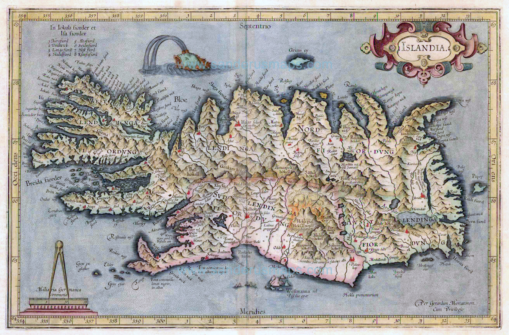

# Setup

## Libraries

```{r setup}
library(tidyverse)    # ggplot2, dplyr, readr, etc.
library(maps)         # basic country outlines as data frames
library(patchwork)    # combining multiple plots
library(marmap)       # NOAA bathymetry data
```

## Data

```{r data}
minke_df <- read_csv("data/minke.csv")        # renamed: avoids overwriting later
smb      <- read_csv("data/smb_summary.csv")
track    <- read_csv("data/small_vms.csv")    # vessel VMS tracks

xlim <- c(-30.0, -10.0)
ylim <- c( 62.5,  67.5)

depth <-
  getNOAA.bathy(lon1 = xlim[1], lon2 = xlim[2],
                lat1 = ylim[1], lat2 = ylim[2],
                resolution = 1, keep = TRUE, path = "./data/") |> # keep the bathymetric data in local memory
  fortify() |>    # convert the bathy object to a plain data frame
  filter(z <= 0)  # keep only sea cells (negative depth)
```

---

# The basis of ggplot2

ggplot2 implements the **Grammar of Graphics** (Wilkinson, 2005) — a principled
framework that describes any statistical graphic as a composition of independent
layers. Because each component is independent, you can add, swap, or modify any
one of them without rewriting the rest. This composability is what makes ggplot2
so powerful.

## The three key components

1. **Data** — a `data.frame` or derivative (`tibble`, `sf`, ...)
2. **Aesthetic mappings** via `aes()` — connecting variables to visual
   properties (position, colour, size, shape, transparency, ...)
3. At least one **layer** via a `geom_*()` function — describing how to render
   the observations

```{r}
ggplot(data = minke_df) +
  aes(x = lon, y = lat, colour = sex) +
  geom_point()
```

All four lines below produce exactly the same plot. The last form is the most
common in practice:

```{r eval=FALSE}
ggplot(data = minke_df)                       + geom_point(aes(x = lon, y = lat, colour = sex))
ggplot(minke_df)                              + geom_point(aes(lon,         lat, colour = sex))
ggplot()                                      + geom_point(data = minke_df, aes(lon, lat, colour = sex))
ggplot(minke_df, aes(lon, lat, colour = sex)) + geom_point()
```

Aesthetics placed inside `ggplot()` are **global** — inherited by all layers.
Aesthetics placed inside a `geom_*()` apply only to that layer. This matters
when you have multiple layers that should map variables differently.

## Saving a plot

A ggplot can be stored as an R object and extended or shared later:

```{r}
#| eval: false
p <- ggplot(minke_df) + geom_point(aes(lon, lat, colour = sex))
class(p)                    # "gg" "ggplot"
p |> write_rds("minke.rds") # save to disk
read_rds("minke.rds")       # retrieve later, or share with a colleague
```

Export to an image file with `ggsave()`. Always set `width`, `height`, and
`dpi` explicitly — the defaults rarely produce publication-ready output:

```{r}
#| eval: false
ggsave("minke.png", plot = p, width = 18, height = 12, units = "cm", dpi = 300)
# see ?ggsave for all format and size options
```

Embed in another Quarto or R Markdown document:

```{r}
#| eval: false
knitr::include_graphics("minke.png") 

```

```

```


::: {.callout-tip}
## Exercise
Create a scatter plot of minke whale sightings with `lon` on the x-axis,
`lat` on the y-axis, and `weight` mapped to `size`. Add `scale_size_area()`.
What does this scale change, and why does it give a more honest representation
than the default `scale_size()`?
:::

---

# Quick backgrounds from the maps package

`map_data()` returns a data frame of polygon coordinates from the **maps**
package. Let's inspect the Iceland object:

```{r}
iceland  <- map_data(map = "world", region = "Iceland")
iceland |> glimpse()  # coordinates named "long" and "lat"; "order" column matters
```

Plotting with four different geoms illustrates why row order matters for
polygon data:

```{r fig.height=6, fig.width=8}
p <- ggplot(iceland, aes(long, lat))
p1 <- p + geom_point()   + labs(title = "geom_point")
p2 <- p + geom_line()    + labs(title = "geom_line")
p3 <- p + geom_path()    + labs(title = "geom_path")
p4 <- p + geom_polygon() + labs(title = "geom_polygon")

p1 + p2 + p3 + p4
```

- `geom_line()` sorts by x before drawing, scrambling the coastline. 
  `geom_path()` connects points in their existing row order — use `?geom_path`
  to confirm this distinction.
- `geom_point()` reveals the data resolution: only 454 rows, so coastline
  detail is limited.
- `geom_polygon()` fills the shape, which is usually what you want for land
  backgrounds. The `group` aesthetic becomes important when polygons contain
  holes (e.g. an island inside a lake).

::: {.callout-note}
## A note on data resolution
The **maps** package coastlines are low-resolution and suitable only for
exploratory work. For publication-quality maps, use higher-resolution
boundaries from the **rnaturalearth** package or the GeoPackage files provided
in this course. Both are introduced in the next session using `geom_sf()`.
:::

---

# Projections and coordinate systems

A map is an xy-plot where the aspect ratio encodes a projection. The distortion
from treating longitude and latitude as equal units becomes obvious when you map
a wide area that spans many degrees of longitude. Here we use the North Atlantic
region — the same area students know from the course data — but zoomed out far
enough that the difference between the three approaches is unmistakeable:

```{r fig.height=5, fig.width=9}
world <- map_data("world")

# A wide northern-hemisphere window: 120° of longitude, 50° of latitude.
# At ~55°N one degree of longitude is roughly half a degree of latitude in
# ground distance, so the uncorrected plot will look obviously squashed.
xlim_demo <- c(-80, 40)
ylim_demo <- c(30, 80)

p_base <- ggplot(world, aes(long, lat, group = group)) +
  geom_polygon(fill = "grey75", colour = "white", linewidth = 0.15) +
  xlim(xlim_demo) +
  ylim(ylim_demo) +
  theme_bw() +
  theme(axis.title = element_blank())

# Panel 1 — no coord at all: ggplot default is a square plot device,
# so 120 degrees of longitude gets the same pixel height as 50 degrees
# of latitude. Everything looks compressed vertically.
p_raw <- p_base +
  labs(title    = "No coord (default)",
       subtitle = "120° lon shown same height as 50° lat")

# Panel 2 — coord_fixed(ratio = 1): forces 1 unit on y = 1 unit on x,
# which is still wrong geographically but at least consistent.
# The map is now far too tall — illustrating that "equal units" ≠ correct map.
p_fixed <- p_base +
  coord_fixed(ratio = 1) +
  labs(title    = "coord_fixed(ratio = 1)",
       subtitle = "equal axis units — still wrong")

# Panel 3 — coord_quickmap(): computes 1/cos(mean latitude) automatically.
# At the centre of this window (~55°N), cos(55°) ≈ 0.57, so the ratio ≈ 1.74.
# Scandinavia, Iceland, and Britain now look like they do on a standard map.
p_qmap <- p_base +
  coord_quickmap(xlim = xlim_demo, ylim = ylim_demo) +
  labs(title    = "coord_quickmap()",
       subtitle = "correct aspect ratio — automatic")

p_raw + p_fixed + p_qmap
```

- In the first panel the map window is 120° wide but only 50° tall, yet ggplot
  squashes them into the same plot height. Britain and Scandinavia look squat
  and compressed.
- In the second panel `coord_fixed(ratio = 1)` enforces equal axis units.
  Now the 50° of latitude takes the same physical space as 50° of longitude,
  making the map extremely tall. This is also wrong — it would only be correct
  at the equator, where one degree of longitude equals one degree of latitude
  in ground distance.
- In the third panel `coord_quickmap()` automatically computes `1 / cos(φ)`
  at the centre latitude (~55°N), giving a ratio of about 1.74. The coastlines
  of Iceland, Norway, and Britain now match what you see on a globe.

The principle scales to any region: the larger the longitude span or the higher
the latitude, the more important the correction becomes. Iceland (ratio ≈ 2.4
at 65°N) is a milder version of the same effect.

::: {.callout-note}
## Why `xlim()` / `ylim()` were used here — and why not to use them for data
In the example above, `xlim()` and `ylim()` are used on the *uncorrected*
panels purely to crop the display to the same geographic window as
`coord_quickmap()`. On real data layers this would clip polygon edges — recall
the pitfall shown in the Layers section. The only safe context for `xlim()` /
`ylim()` is on a `geom_polygon()` basemap used purely as a background, and
even then `coord_quickmap(xlim, ylim)` is the cleaner approach.
:::

::: {.callout-note}
## `coord_quickmap()` vs `coord_sf()`
`coord_quickmap()` is a fast approximation that works well for small areas at
mid-latitudes. For correct projections — especially over large extents, near
the poles, or in projected CRS — use `coord_sf()` from the **sf** package. All
later sessions in this course use `coord_sf()`.
:::

---

# Layers

## Building a reusable base map

A common workflow is to build a base map object once and reuse it by adding
layers on top. Here is a clean base map for Iceland:

```{r}
basemap <- ggplot() +
  geom_polygon(data    = iceland,
               mapping = aes(x = long, y = lat, group = group),
               fill    = "grey80",
               colour  = "white") +
  coord_quickmap(xlim = c(-27, -11), ylim = c(62.5, 67.5)) +
  scale_x_continuous(NULL, NULL) +   # suppress axis titles and tick labels
  scale_y_continuous(NULL, NULL) +
  theme_bw() +
  labs(caption = "Source: maps package")

basemap
```

Note the `group = group` aesthetic: without it, `geom_polygon()` would
connect all coordinates in a single polygon, producing a mess when Iceland
has multiple separate polygons (islands, etc.).

Any subsequent `+` call adds a new layer on top of this base.

## A pitfall: zooming with `xlim()` / `ylim()` vs `coord_quickmap()`

`xlim()` and `ylim()` **remove** data outside the range before drawing. For
polygon data this clips features mid-edge, producing cut coastlines. Setting
limits inside `coord_quickmap()` zooms the *view* without discarding any data:

```{r fig.height=4}
dont <- basemap +
  xlim(-22, -17) + ylim(63.5, 65) +
  labs(title = "xlim() / ylim()", subtitle = "data clipped — coastline cut")

do <- basemap +
  coord_quickmap(xlim = c(-22, -17), ylim = c(63.5, 65)) +
  labs(title = "coord_quickmap(xlim, ylim)", subtitle = "view zoomed — coastline intact")

dont + do
```

::: {.callout-important}
Always zoom a map via `coord_quickmap(xlim = ..., ylim = ...)` or
`coord_sf(xlim = ..., ylim = ...)`. Never use bare `xlim()` / `ylim()` for
spatial data.
:::

## `geom_point()` — bubble plots

Mapping a continuous variable to `size` creates a bubble chart. Use
`scale_size_area()` so that **area** (not radius) is proportional to the
value — a perceptually honest encoding where zero maps to zero area:

```{r}
p_minke <- basemap +
  geom_point(data  = minke_df,
             aes(lon, lat, size = age),
             alpha = 0.3, colour = "red") +
  scale_size_area(max_size = 10) +
  labs(title = "Minke whale sightings", size = "Age (years)")

p_cod <- basemap +
  geom_point(data  = smb |> filter(year == 2019),
             aes(lon1, lat1, size = cod_n),
             alpha = 0.3, colour = "red") +
  scale_size_area(max_size = 10) +
  labs(title = "Cod catch — SMB 2019", size = "Cod (n)")

p_minke + p_cod
```

::: {.callout-tip}
## Exercise
Replace `cod_n` with `saithe_n` or `haddock_n`. Do the spatial patterns
differ across species?
:::

## `geom_segment()` — tow tracks

`geom_segment()` draws a straight line between a start and end coordinate
pair — ideal for a quick visualisation of tow tracks:

```{r}
basemap +
  geom_segment(data = smb |> filter(year == 2019),
               aes(x = lon1, y = lat1, xend = lon2, yend = lat2),
               linewidth = 0.3) +
  labs(title = "SMB 2019 tow tracks")
```

## `geom_raster()` — gridded summaries

`geom_raster()` draws filled rectangles centred on each (x, y) coordinate.
It is efficient for pre-gridded data where the grid spacing is perfectly
regular. For irregular grids, use `geom_tile()` instead — it is slightly
slower but does not require equal cell sizes:

```{r}
s <- smb |>
  filter(year == 2019) |>
  group_by(ir_lon, ir_lat) |>        # ICES rectangles: 1.0° × 0.5°
  summarise(Cod = mean(cod_n), .groups = "drop")

basemap +
  geom_raster(data = s, aes(ir_lon, ir_lat, fill = Cod)) +
  scale_fill_viridis_c(option = "B", direction = -1, name = "Mean cod (n)") +
  labs(title = "Mean cod catch per ICES rectangle — SMB 2019")
```

## `geom_path()` — vessel tracks

`geom_path()` connects points **in the order they appear in the data** —
the right choice for time-ordered GPS tracks. `geom_line()` would sort by
x first, scrambling any track that doubles back on itself:

```{r}
basemap +
  geom_path(data     = track,
            aes(x = lon, y = lat, colour = factor(id)),
            linewidth = 0.4, alpha = 0.8) +
  scale_colour_brewer(name = "Vessel", palette = "Set1") +
  labs(title = "VMS vessel tracks — SMB 2019")
```

---

# `geom_contour()` — isolines

`geom_contour()` draws lines of equal value over a gridded surface. Here we
layer it on top of a bathymetry raster to add depth reference lines:

```{r}
p_depth <- ggplot() +
  geom_raster(data = depth, aes(x = x, y = y, fill = z)) +
  geom_polygon(data = iceland, aes(long, lat, group = group), fill = "grey60") +
  scale_fill_viridis_c(option = "D", name = "Depth (m)") +
  coord_quickmap() +
  scale_x_continuous(NULL, NULL) +
  scale_y_continuous(NULL, NULL) +
  theme_bw() +
  labs(title    = "Bathymetry around Iceland",
       caption  = "Source: NOAA ETOPO1 via marmap")

p_depth +
  geom_contour(data = depth,
               aes(x = x, y = y, z = z),
               breaks    = c(-50, -100, -200, -400, -1000),
               linewidth = 0.3,
               colour    = "white") +
  labs(title = "Bathymetry with depth contours")
```

::: {.callout-tip}
## Exercise
Change the `breaks` to show only the shelf edge (around −200 m) and the deep
basin (around −1000 m). Try a different contour colour and add a subtitle
listing the depths shown.
:::

---

# Gridding point data with `grade()`

Sometimes you want to aggregate point observations to a regular lon–lat grid
at a resolution that does not correspond to any pre-existing classification
(such as ICES rectangles). The helper function below bins coordinates to a
grid and returns the cell midpoint:

```{r}
grade <- function(x, dx) {
  if (dx > 1) warning("Not tested for grids larger than one degree")
  brks <- seq(floor(min(x)), ceiling(max(x)), dx)
  ints <- findInterval(x, brks, all.inside = TRUE)
  (brks[ints] + brks[ints + 1]) / 2
}

smb2019_gridded <- smb |>
  filter(year == 2019) |>
  mutate(glon = grade(lon1, 0.5),
         glat = grade(lat1, 0.25)) |>
  group_by(glon, glat) |>
  summarise(Cod = mean(cod_n), .groups = "drop")

basemap +
  geom_tile(data = smb2019_gridded,
            aes(x = glon, y = glat, fill = Cod)) +
  scale_fill_viridis_c(option    = "B",
                       direction = -1,
                       transform = "log1p",
                       name      = "Mean cod (n)\n(log scale)") +
  labs(title = "Cod catch gridded at 0.5° × 0.25° — SMB 2019")
```

`geom_tile()` is used here rather than `geom_raster()` because the output
of `grade()` may have slight floating-point irregularities that cause
`geom_raster()` to fail. For a perfectly regular grid produced by other means,
`geom_raster()` is faster.

::: {.callout-note}
A more rigorous gridding approach using `sf` polygon grids and spatial joins
(`st_make_grid()` + `st_join()`) is covered in the next session, where we work
directly with `sf` objects.
:::

::: {.callout-tip}
## Exercise
Modify the `grade()` call to produce a coarser 1.0° × 0.5° grid and a finer
0.25° × 0.125° grid. How does the choice of resolution affect the visible
spatial pattern?
:::

---

# Further reading

The [ggplot2 book](https://ggplot2-book.org) is the definitive reference.
Chapter 3 (individual geoms) and Chapter 11 (colour scales) are particularly
relevant to mapping.
