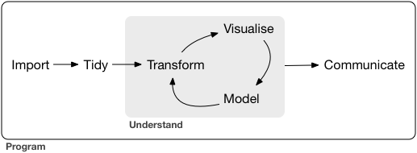

# About this course

This course provides a practical introduction to mapping and spatial analysis using R. It is aimed at researchers and analysts in fisheries and marine science who already have some familiarity with R and want to work effectively with spatial data — reading and writing spatial files, manipulating vector and raster data, making maps, and applying spatial analysis methods.

The course material is open source. The source code and datasets are available at:

- **Course website**: <https://heima.hafro.is/~julian/TCMSAR26/index.html>
- **Datasets**: <https://heima.hafro.is/~julian/ftp/data.zip>

https://github.com/jmburgos/TCMSAR26

---

# What this course covers

Spatial analysis fits naturally into the standard data science workflow of import → tidy → transform → visualise → model → communicate. This course focuses on all of these steps as they apply to **spatial** data specifically.

```{r out.width="75%", fig.cap="From: Grolemund and Wickham (R for Data Science)", echo=FALSE}

```

By the end of the course you will be able to:

- Understand the key concepts behind spatial data: vector and raster data models, coordinate reference systems, and projections.
- Read and write spatial data in common formats (GeoPackage, shapefile, GeoTIFF, CSV).
- Create and manipulate vector data using the **sf** package: points, lines, and polygons.
- Perform geometric operations on sf objects: buffers, centroids, intersections, spatial joins.
- Work with raster data using the **terra** package: reading, cropping, resampling, and raster algebra.
- Make publication-quality static maps with **ggplot2**.
- Build interactive web maps with **leaflet**.
- Apply basic spatial interpolation methods.

## Course outline

The chapters follow a logical progression from concepts to tools to applications:

| Chapter | Topic |
|---|---|
| Spatial data | What spatial data is; vector and raster models; the R package ecosystem |
| Simple features | The sf class; reading files; creating sf objects from coordinates |
| Geometries in sf | Geometric operations: buffers, centroids, convex hulls, grids |
| Spatial operations | Spatial joins, subsetting, and binary predicates |
| Coordinate reference systems | Ellipsoids, datums, projections; reprojecting data |
| Rasters | The terra package; reading, manipulating, and analysing raster data |
| Reading and writing spatial data | File formats and GDAL; reading and writing with sf and terra |
| Mapping with ggplot2 | Static maps; layers, projections, colour scales, facetting |
| Interactive maps | leaflet; basemaps, markers, polygons, layer control |
| Interpolation | Voronoi polygons, IDW, kriging, GAMs |

---

# Datasets used in this course

The same datasets reappear across multiple chapters, so it is worth knowing what they are from the start. All data files are available in the course data archive linked above.

## Icelandic bottom trawl survey (SMB)

The spring groundfish survey (*Spawning groundfish survey*, SMB) conducted annually by the Marine and Freshwater Research Institute (MFRI) of Iceland. The main files used are:

- `is_smb.csv` — station data including tow positions, duration, and catch by species.
- `is_smb_stations.csv` — station metadata.
- `is_smb_biological.csv` — biological data (length, weight) by species and station.
- `is_smb_vms2019.csv` — Vessel Monitoring System (VMS) positions for the 2019 survey, giving detailed vessel tracks.
- `is_smb_cod_rbya.csv` — cod abundance by year, age, and station.

This dataset is used to illustrate tow tracks, abundance mapping, spatial interpolation, and facetted maps across years.

## ICES DATRAS surveys

Trawl survey data from the ICES Database of Trawl Surveys (DATRAS), covering multiple European surveys in 2018:

- `datras_2018_haul.csv` — haul (station) data including positions.
- `datras_2018_length.csv` — length frequency data by species and haul.

Used to illustrate spatial operations, interactive maps, and working with data from multiple surveys across a broad geographic area.

## Minke whale sightings

- `minke.csv` — positions and biological measurements of minke whales sampled in Icelandic waters.

Used in mapping examples throughout the ggplot2 chapter.

## Spatial boundary files

Several vector boundary files are used as reference layers:

- `iceland_coastline.gpkg` — Iceland coastline.
- `iceland_contours.gpkg` — depth contours around Iceland.
- `bormicon.gpkg` — Bormicon reporting areas for Icelandic fisheries.
- `nephrops_fu.gpkg` — Nephrops functional units (ICES assessment areas).
- `ices_ecoregions.gpkg` — ICES ecoregion boundaries.
- `ices_rectangles.gpkg` — ICES statistical rectangles.
- `helcom.gpkg` and `ospar.gpkg` — HELCOM and OSPAR regional sea boundaries.

## Raster data

- `Iceland_minbtemp.tif`, `Iceland_maxbtemp.tif` — minimum and maximum near-bottom temperature around Iceland (from the NISE project).
- `Iceland_currentsp.tif` — near-bottom current speed (from Bio-ORACLE).
- `nephrops.tif` — Nephrops trawl effort raster.
- Bottom depth data accessed via the `marmap` package from NOAA's ETOPO1 database.

---

# Getting started

## Software

You will need a recent version of R and an IDE. We recommend RStudio (now distributed by Posit):

- **R**: download from [CRAN](https://cran.r-project.org/). If you are on Windows, also install [Rtools](https://cran.r-project.org/bin/windows/Rtools). On macOS, install the Command Line Tools via `xcode-select --install` in a terminal.
- **RStudio**: download from [posit.co](https://posit.co/download/rstudio-desktop/).

## RStudio projects

We strongly recommend doing all your work inside an **RStudio project**. Projects keep your files, working directory, and settings organised and isolated from other work. To create one: *File → New Project → New Directory → New Project*.

A sensible directory structure for this course might look like:

```
spatial_course/
├── data/               # Downloaded course data files
├── R/                  # Your R scripts
├── spatial_course.Rproj
└── my_analysis.qmd     # Your own Quarto documents
```

::: {.callout-warning}
## Do not save your workspace
When RStudio asks whether to save your workspace (`.RData`) on exit, always say **No**. Saving the workspace causes hard-to-diagnose bugs by carrying objects from one session into the next. Instead, keep your code in scripts so you can always recreate your results from scratch.

To turn this off permanently: *Tools → Global Options → General → Save workspace to .RData on exit → Never*.
:::

## Installing packages

Install all the packages used in this course by running the following. You only need to do this once:

```{r install, eval=FALSE}
install.packages(c(
  # Core spatial packages
  "sf",          # Vector spatial data
  "terra",       # Raster spatial data
  "stars",       # Spatiotemporal data cubes

  # Tidyverse
  "tidyverse",   # Data wrangling and visualisation

  # Mapping
  "ggplot2",     # Static maps (installed with tidyverse)
  "ggspatial",   # Scale bars, north arrows
  "leaflet",     # Interactive maps
  "mapview",     # Quick interactive map previews
  "rnaturalearth",   # Country and region boundaries
  "rnaturalearthdata",

  # Raster data access
  "marmap",      # NOAA bathymetry data

  # Interpolation
  "gstat",       # Geostatistics and interpolation
  "mgcv",        # GAMs
  "concaveman",  # Concave hulls

  # Utilities
  "crsuggest",   # CRS selection helper
  "patchwork",   # Combining ggplot figures
  "units"        # Physical units for spatial measurements
))
```

::: {.callout-note}
## A note on raster packages
This course uses **terra** for raster data. The older **raster** package has similar functionality but different syntax -- `rast()` replaces `raster()`, and `c()` replaces `stack()`. For the full history of the R spatial ecosystem, see the [Spatial data concepts](spatial_data.qmd#the-r-ecosystem-for-spatial-data) chapter.
:::

## Verify your installation

Once packages are installed, check that the key spatial ones load correctly:

```{r verify, eval=FALSE}
library(sf)
library(terra)
library(tidyverse)
library(leaflet)
```

If these load without errors, you are ready to begin.

::: {.callout-note}
## Setup exercise
1. Create a new RStudio project for this course.
2. Download the course data archive from <https://heima.hafro.is/~julian/ftp/data.zip> and unzip it into a `data/` folder inside your project.
3. Install the packages above and verify they load.
4. Open a new Quarto document (*File → New File → Quarto Document*) and write a short code chunk that reads `is_smb.csv` from your data folder and prints the first few rows with `head()`. Render the document to make sure everything works end to end.
:::

---

# A note on reproducibility

One of R's biggest advantages over point-and-click GIS tools is that your entire analysis — from reading raw data to producing a final map — can be written as a script and re-run exactly by anyone, on any machine. This course is written in **Quarto** (`.qmd` files), which weaves code, output, and prose into a single reproducible document. All the examples in this course are self-contained: if you have the data and the packages installed, you can run any chapter from top to bottom and get the same results.

We encourage you to work the same way: keep your code in scripts or Quarto documents, and avoid manually editing data files or saving plots by hand. Everything should flow from code.
