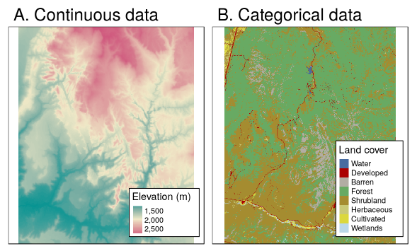
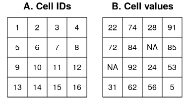

# Getting started
___

**Packages needed for this tutorial**:
```{r setup}
library(tidyverse)   # installs sweeps of packages
library(sf)          # working with sf objects in R
library(terra)       # working with rasters in R (replaces raster/rgdal)
library(tidyterra)   # ggplot2 integration for terra objects
library(marmap)      # access global topography data
```

::: {.callout-note}
This tutorial uses the **terra** package, which replaced the older **raster** and **rgdal** packages (both retired from CRAN at the end of 2023). The **terra** API is very similar to **raster**, so if you have used **raster** before you will find the transition straightforward. The main differences are noted throughout.
:::

# Raster data model

Raster data is used to represent parameters that vary continuously in space.

A raster represents some area as a regular grid of equally sized rectangles, known as cells or pixels.

Each cell can hold one or more data values (i.e. single-layer and multi-layer rasters). Data can be continuous (e.g. depth, temperature) or discrete/categorical (e.g. land types). Satellite images are rasters. Rasters are also used to store the output of interpolations and of oceanographic models.

<center>
{width=50%}
</center>

Each cell has an individual ID. To define a raster you need to define:

  - The cell size (also known as grain or resolution)
  - The extent (raster size) or number of cells
  - The origin (the lowest x and y values)
  - The coordinate reference system

<center>
{width=50%}
</center>

Some raster formats can have multiple bands (layers).

# Raster classes in R

The **terra** package provides a single class, **SpatRaster**, which handles both single-layer and multi-layer rasters. This replaces the three separate classes of the old **raster** package (`RasterLayer`, `RasterBrick`, `RasterStack`).

For vector data, **terra** provides the **SpatVector** class, though in this course we mainly use **sf** objects for vector data. The two are interoperable: `vect()` converts an sf object to a SpatVector, and `st_as_sf()` goes the other direction.

# Reading rasters into R

There are many different formats for raster data. The **terra** package uses the external library **GDAL** to read them. You can get the list of all possible formats here:

- https://gdal.org/drivers/raster/index.html

GeoTIFF (`.tif` or `.tiff`) and ASCII grid (`.asc`) are two of the most common formats.

Reading rasters with **terra** uses the `rast()` function. Let's try it with a raster with bottom temperature around Iceland. These were compiled using data from NISE (Norwegian Iceland Seas Experiment) project.

```{r}
# Minimum temperature
mintemp <- rast("./data/Iceland_btemp.tif")

# Maximum temperature
maxtemp <- rast("ftp://ftp.hafro.is/pub/data/rasters/Iceland_maxbtemp.tif")

# And a bit of data off the Faroe Islands
far_temp <- rast("ftp://ftp.hafro.is/pub/data/rasters/Faroes_minbtemp.tif")

# Multi-layer rasters: pass a vector of paths, or use c()
files <- c("ftp://ftp.hafro.is/pub/data/rasters/Iceland_minbtemp.tif",
           "ftp://ftp.hafro.is/pub/data/rasters/Iceland_maxbtemp.tif")

temps <- rast(files)

class(mintemp)    # SpatRaster
nlyr(mintemp)     # number of layers (replaces nlayers())

class(temps)
nlyr(temps)
names(temps)
```

We can do a quick plot using terra's built-in plot method.

```{r}
plot(mintemp)

plot(temps)
```

# Raster metadata

Printing a SpatRaster shows its metadata, including dimensions, resolution, extent, coordinate reference system, and value range.

To get the metadata directly from the file without fully reading it into memory, use `describe()`:

```{r}
describe("ftp://ftp.hafro.is/pub/data/rasters/Iceland_minbtemp.tif")
```

The coordinate reference system can be extracted (and set) with `crs()`:

```{r}
crs(mintemp)
```

The `ext()` function provides an object of class *SpatExtent* with the ranges of the horizontal and vertical coordinates:

```{r}
ext(mintemp)    # replaces extent()

bbox(mintemp)   # a matrix, compatible with sf
```

# Summary statistics

The function `global()` computes summary statistics of a *SpatRaster* object. This replaces `cellStats()` from the old **raster** package.

```{r}
global(mintemp, mean, na.rm = TRUE)
global(temps, mean, na.rm = TRUE)

summary(mintemp)

hist(mintemp)
```

# Rasters with categorical (factor) data

SpatRaster objects can store logical, integer, continuous or categorical data.

```{r}
# Create classification matrix
cm <- matrix(c(
  -2, 2, 1,
  2,  4, 2,
  4, 10, 3),
  ncol = 3, byrow = TRUE)

# Reclassify: replaces reclassify()
temp_reclass <- classify(mintemp, cm)

is.factor(temp_reclass)

plot(temp_reclass)

# Make a factor raster
temp_factor <- as.factor(temp_reclass)
is.factor(temp_factor)

# Add category labels to the raster attribute table
levels(temp_factor) <- data.frame(ID = 1:3,
                                  category = c("cold", "mild", "warm"))

plot(temp_factor)
```

With **tidyterra** we can plot categorical rasters with ggplot naturally:

```{r}
ggplot() +
  geom_spatraster(data = temp_factor) +
  scale_fill_manual(values = c("blue", "lightblue", "red"),
                    na.value = "transparent",
                    name = "Category")
```

# Manipulation of raster objects

## Extracting values from a raster

To extract values from a *SpatRaster*, we use the bracket `[` operator or the `extract()` function. Note that the **terra** `extract()` lives in the **terra** namespace, so if **tidyverse** is also loaded you may need to call it explicitly as `terra::extract()`.

```{r}
mintemp[239]          # Cell ID = 239

mintemp[20, 50]       # Row 20, column 50

# Same as...
cell <- cellFromRowCol(mintemp, 20, 50)
mintemp[cell]

mintemp[20:25, 50:55] # Submatrix

# With drop = FALSE we get a new SpatRaster instead of a vector
rst <- mintemp[20:25, 50:55, drop = FALSE]
plot(rst)

# Crop using an extent object
ext_obj <- ext(c(-944011, -784505, -278260, -160260))
rst <- crop(mintemp, ext_obj)
plot(rst)
```

## Replacing values

```{r}
rst <- mintemp[20:25, 50:55, drop = FALSE]

rst[4, 2] <- rst[4, 2] + 30
rst[1:2]  <- rst[1:2]  + 10
plot(rst)
```

## Masks

We can mask a raster with another raster that shares the same geometry. Cells with `NA` values in the mask are removed from the masked raster.

```{r}
rst <- mintemp[100:135, 50:85, drop = FALSE]

# Create an empty raster with the same geometry
my.mask <- rast(rst)
values(my.mask) <- 1   # Non-NA everywhere

set.seed(100)
cells <- sample(1:ncell(my.mask), 20)
my.mask[cells] <- NA

rst_masked <- mask(rst, my.mask)

par(mfrow = c(1, 2))
plot(rst)
plot(rst_masked)
```

## Extracting raster data with sf objects

```{r}
bt_points <- read_sf("ftp://ftp.hafro.is/pub/data/shapes/ice_points.gpkg")
bt_lines  <- read_sf("ftp://ftp.hafro.is/pub/data/shapes/ice_lines.gpkg")
bt_poly   <- read_sf("ftp://ftp.hafro.is/pub/data/shapes/ice_polygon.gpkg")

plot(mintemp)
plot(vect(bt_points), add = TRUE)
plot(vect(bt_lines),  add = TRUE)
plot(vect(bt_poly),   add = TRUE)
```

We use `terra::extract()` to extract raster values using sf objects (converted to SpatVector with `vect()`):

- For POINT geometry: values of the cells where the points are located.
- For LINESTRING geometry: values of the cells touched by the line.
- For POLYGON geometry: values of the cells whose centres fall within the polygon.

```{r}
ex1 <- terra::extract(mintemp, vect(bt_points))  # data frame, one row per point
ex2 <- terra::extract(mintemp, vect(bt_lines))   # data frame, one row per cell touched
ex3 <- terra::extract(mintemp, vect(bt_poly))    # data frame, one row per cell

# With cell numbers
ex3_cells <- terra::extract(mintemp, vect(bt_poly), cells = TRUE)
```

We can also use an sf object as a cookie cutter to mask a raster with `mask()`. Make sure that they share the same CRS.

```{r}
temp_masked     <- mask(mintemp, vect(bt_poly))
temp_masked_inv <- mask(mintemp, vect(bt_poly), inverse = TRUE)

par(mfrow = c(1, 2))
plot(temp_masked)
plot(temp_masked_inv)
```

# Raster algebra

Rasters are a very efficient way to do mathematical operations on spatial data, because the cell coordinates do not need to be handled explicitly.

```{r}
tempkelv <- mintemp + 273
tempsq   <- mintemp ^ 2
tempdiff <- maxtemp - mintemp

par(mfrow = c(1, 2))
plot(mintemp)
plot(tempkelv)
plot(tempsq)
plot(tempdiff)
```

For applying a custom function across layers, use `app()` (which replaces `calc()` from the old **raster** package):

```{r}
# Mean across layers
temp_mean <- app(temps, mean)
plot(temp_mean)
```

# Moving window operations

A moving window operation (also known as a kernel) is a computation carried out in each cell using values of adjacent cells.

Let's calculate the variability of bottom depth using two window sizes.

```{r}
# Get depth data
xlim <- c(-28, -10)
ylim <- c(62.5, 67.5)

depth <-
  getNOAA.bathy(lon1 = xlim[1], lon2 = xlim[2],
                lat1 = ylim[1], lat2 = ylim[2],
                resolution = 1, keep = TRUE) %>%
  marmap::as.raster() %>%   # marmap still returns a raster object
  rast()                     # convert to terra SpatRaster

writeRaster(depth, "./data/Iceland_depth.tif", overwrite = TRUE)

depth[depth > 0] <- NA  # Ignore land

# Small scale depth variability: 3x3 window
depth_var_ss <- focal(depth,
                      w = matrix(1/9, nrow = 3),
                      fun = var,
                      na.rm = TRUE)

# Large scale depth variability: 15x15 window
depth_var_ls <- focal(depth,
                      w = matrix(1/225, nrow = 15),
                      fun = var,
                      na.rm = TRUE)

par(mfrow = c(1, 2))
plot(depth_var_ss, zlim = c(0, 1000))
plot(depth_var_ls)
```

# Zonal statistics

Zonal statistics refers to the calculation of statistics on values of a raster within the zones of another raster. Both rasters need to have the same geometry.

```{r}
# Near-bottom current speeds
current_sp <- rast("ftp://ftp.hafro.is/pub/data/rasters/Iceland_currentsp.tif")

# Classification matrix
cm <- matrix(c(
     0, -400, 1,
  -400, -700, 2,
  -700,-2500, 3),
  ncol = 3, byrow = TRUE)

depth_reclass <- classify(depth, cm)

# Make sure rasters have the same geometry
compareGeom(depth, current_sp)

# Mean current speed per depth zone (replaces zonal())
zonal(current_sp, depth_reclass, fun = mean, na.rm = TRUE)

# Range of current speeds per depth zone
zonal(current_sp, depth_reclass, fun = range, na.rm = TRUE)
```

# Changing the geometry of a raster

## Modify the extent and origin

```{r}
ex_depth <- extend(depth, c(40, 500))  # Larger extent

or_depth <- depth
origin(or_depth) <- c(0, 0)           # Change origin

ext(depth)
ext(or_depth)
```

## Changing the resolution

`aggregate()` and `disagg()` change the resolution by merging or splitting cells. Note: in **terra**, `disaggregate()` is renamed `disagg()`.

```{r}
res(depth)   # Resolution
dim(depth)   # Rows, columns, layers

agg_depth <- aggregate(depth, fact = 5, fun = mean)
dim(agg_depth)

dis_depth <- disagg(depth, fact = 5, method = "bilinear")
dim(dis_depth)

plot(depth)
plot(agg_depth)
plot(dis_depth)
```

## Cropping

```{r}
ext_obj    <- ext(c(-25, -20, 63, 65))
crop_depth <- crop(depth, ext_obj)
plot(crop_depth)
```

## Merging rasters

```{r}
ice_temp <- mintemp + 10

# merge(): overlapping cells use values from the first raster
icefar_temp <- merge(ice_temp, far_temp)
plot(icefar_temp)

# mosaic(): overlapping cells are combined using a function
icefar_temp2 <- mosaic(ice_temp, far_temp, fun = "mean")
plot(icefar_temp2)
```

## Resampling and projecting rasters

**Resampling** transfers values between rasters with different origin or resolution. **Projecting** additionally changes the coordinate reference system. In **terra** both are handled by `resample()` and `project()` (the latter replaces `projectRaster()`).

```{r}
# Create a target raster with a shifted origin and finer resolution
target1 <- rast(depth)
origin(target1) <- c(0, 0)
res(target1)    <- 0.025

depth_res <- resample(depth, target1, method = "bilinear")

# Changing the CRS (replaces projectRaster())
crs(depth)
crs(mintemp)

# Match only the CRS
depth_proj1 <- project(depth, crs(mintemp))

# Complete raster alignment (CRS + geometry)
depth_proj2 <- project(depth, mintemp)
```

Use `method = "bilinear"` for continuous rasters and `method = "near"` (nearest neighbour) for categorical or integer rasters.

# Rasterization

Rasterization converts vector data into a raster.

```{r}
# A target raster from scratch
target <- rast(xmin = -28, xmax = -10,
               ymin = 62.5, ymax = 67.5,
               res = 0.2,
               crs = "EPSG:4326")

stations <- read_csv("ftp://ftp.hafro.is/pub/data/csv/is_smb_stations.csv") %>%
  st_as_sf(coords = c("lon1", "lat1"), crs = 4326)

# Rasterize: count of stations per cell
station_rst1 <- rasterize(vect(stations), target, fun = "count")

# Rasterize: sum of a field
station_rst2 <- rasterize(vect(stations), target,
                           field = "duration", fun = "sum")

par(mfrow = c(1, 2))
plot(station_rst1, main = "Number of stations")
plot(vect(stations), add = TRUE, pch = ".")
plot(station_rst2, main = "Total towing time")
```

Rasterizing polygons:

```{r}
is_areas <- read_sf("ftp://ftp.hafro.is/pub/data/shapes/bormicon.gpkg")

# Rasterize by polygon ID
is_areas_rst <- rasterize(vect(is_areas), target)
plot(is_areas)
plot(is_areas_rst)

# Rasterize by an attribute field
is_areas_rst2 <- rasterize(vect(is_areas), target, field = "area")
plot(is_areas_rst2)
```

# Rasters and ggplot

The **tidyterra** package provides `geom_spatraster()`, which lets you plot SpatRaster objects directly with ggplot without first converting them to a data frame. This is the recommended approach.

```{r}
depth <- rast("./data/Iceland_depth.tif")

coast <- read_sf("ftp://ftp.hafro.is/pub/data/shapes/iceland_coastline.gpkg") %>%
  st_transform(4326)

ggplot() +
  geom_spatraster(data = depth) +
  geom_sf(data = coast) +
  scale_fill_viridis_c(na.value = "transparent") +
  theme_bw()
```

If you prefer to work with a data frame (for example to use `geom_raster()`), you can still convert:

```{r}
depth.df <- as.data.frame(depth, xy = TRUE)
head(depth.df)

ggplot() +
  geom_raster(data = depth.df, aes(x = x, y = y, fill = Iceland_depth)) +
  geom_sf(data = coast) +
  scale_fill_viridis_c(na.value = "transparent") +
  theme_bw()
```

`geom_spatraster()` is generally preferable for large rasters because it sub-samples intelligently to match screen resolution, while `geom_raster()` will attempt to render every cell.

# The **stars** package

The **stars** package provides datacubes — dense arrays for storing spatio-temporal data where space (2D or 3D) and time are the array dimensions. It is not a replacement for **terra** but complements it, and it plays well with the tidyverse.

```{r}
library(stars)

depth.st <- st_as_stars(depth)

ggplot() +
  geom_stars(data = depth.st) +
  geom_sf(data = coast) +
  scale_fill_viridis_c(na.value = "transparent")
```

For more on **stars**: https://r-spatial.github.io/stars/
