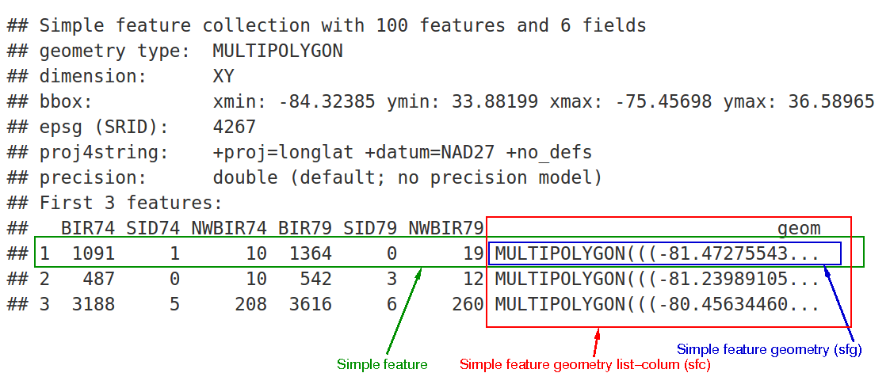

```{r setup}
library(tidyverse)
library(sf)
```

# Vector data in R

The **sf** package is the standard way to work with vector spatial data in R. It provides a class — also called *sf* — that represents spatial features as an extension of a regular data frame, integrating naturally with tidyverse tools like dplyr and ggplot2.

An older package, **sp**, defined a different set of classes for the same purpose. You will encounter sp in older code and in some packages that have not yet migrated, but you should not start new work with it. Conversion between the two is straightforward and is covered briefly at the end of this chapter.

---

# The simple feature standard

A **feature** is any object or observation in the real world that has a location. Features have two components:

- A **geometry**: where on Earth the feature is located.
- **Attributes**: properties describing the feature (species, abundance, depth, etc.).

**Simple features** is an international open standard (OGC/ISO 19125) specifying how to represent two-dimensional geometries using points and straight lines (no curves). It defines:

- A unified way to represent vector data.
- A set of topological predicates and operations.
- Well-known text (WKT) and binary (WKB) encodings.
- Support across spatial databases (PostGIS, SQLite/SpatiaLite), GeoJSON, GDAL, GEOS, and many other tools.

The sf package implements this standard in R, which means sf objects are directly compatible with spatial databases and other software that follows the same standard.

## Geometry types

The seven most common simple feature geometry types are:

| Type | Description |
|---|---|
| POINT | A single location |
| LINESTRING | A sequence of points connected by straight lines |
| POLYGON | A closed ring of points forming an area |
| MULTIPOINT | A set of points as a single feature |
| MULTILINESTRING | A set of linestrings as a single feature |
| MULTIPOLYGON | A set of polygons as a single feature |
| GEOMETRYCOLLECTION | A mix of any geometry types |


Additional types exist in the standard (CIRCULARSTRING, SURFACE, TRIANGLE, etc.) but are not supported by the sf package and rarely encountered in practice.

---

# The structure of sf objects

In a nutshell, an *sf* object is a data frame (or tibble) with one special column that holds the geometry for each row. Each row is one feature.



The three levels of the sf class system are:

- **sfg** (simple feature geometry): the geometry of a single feature — one point, one polygon, etc.
- **sfc** (simple feature geometry column): a list column of sfg objects, with a shared CRS and bounding box. This is the geometry column of an sf object.
- **sf**: the complete object — a data frame with an sfc geometry column attached.

## What is a list column?

A regular data frame column holds a vector of values of the same type. A **list column** holds a list — each element can be a different type or length. This is how sf stores geometry: each row's geometry (which might be a simple point or a complex multipolygon with many coordinates) is stored as one element of a list column.

```{r}
# A regular data frame is itself a list of equal-length vectors
my_df <- data.frame(a = 7:9, b = c("a", "b", "c"), c = c(10, 20, 30))
is.list(my_df)   # TRUE

# A list column holds a list as one of those vectors
my_list <- list(1:2, "Hello", c("A", "B", "C"))
my_df$d <- my_list
print(my_df)
```

The geometry column in an sf object works exactly this way — each element is the sfg geometry for that feature.

---

# Building sf objects from scratch

It is rarely necessary to construct sf objects manually, but understanding how they are built helps clarify the class structure.

```{r}
# 1. Create individual geometries (sfg objects)
p1 <- st_point(c(-20, 66))
p2 <- st_point(c(-19, 65.5))

class(p1) # "sfg" and "POINT"

# 2. Combine into a geometry column (sfc object)
pts <- st_sfc(p1, p2, crs = 4326)
class(pts) # "sfc_POINT" and "sfc"

pts # Has a bounding box and CRS

# 3. Attach attribute data to get a full sf object
mydata <- tibble(station = c("A", "B"), depth_m = c(120, 240))
mysf <- st_as_sf(mydata, geometry = pts)

class(mysf) # "sf" and "tbl_df" and "data.frame"
mysf
```

Builder functions for other geometry types:

| Function | Required input |
|---|---|
| `st_point()` | numeric vector |
| `st_multipoint()` | numeric matrix with points in rows |
| `st_linestring()` | numeric matrix with points in rows |
| `st_multilinestring()` | list of numeric matrices |
| `st_polygon()` | list of numeric matrices (first = outer ring, rest = holes) |
| `st_multipolygon()` | list of lists of numeric matrices |
| `st_geometrycollection()` | list of sfg objects |

---

# Reading sf objects from files

In practice you will almost always read sf objects from files rather than building them manually. The `read_sf()` function handles this, supporting dozens of formats via GDAL.

```{r}
# Read a GeoPackage file
nfu <- read_sf("./data/nephrops_fu.gpkg")

class(nfu)
glimpse(nfu)
```

::: {.callout-note}
## `read_sf()` vs `st_read()`
Both functions read spatial data. `read_sf()` is a tidyverse-friendly wrapper around `st_read()` with better defaults: it returns a tibble, does not convert strings to factors, and prints output more quietly. Prefer `read_sf()` for new work.
:::

## Inspecting an sf object

When you print an sf object, the header shows the key metadata before the data:

```{r}
nfu
```

The header tells you:
- **Geometry type**: POLYGON in this case.
- **Dimension**: XY (2D). Can also be XYZ, XYM, or XYZM.
- **Bounding box**: the extent of the data in the coordinate units.
- **CRS**: the coordinate reference system (shown in WKT2 format in modern sf).

You can extract these individually:

```{r}
st_geometry_type(nfu)   # Geometry type of each feature
st_crs(nfu)             # Full CRS information
st_crs(nfu)$Name        # CRS name
st_crs(nfu)$epsg        # EPSG code (if defined)
st_bbox(nfu)            # Bounding box

# Standard data frame functions also work
nrow(nfu)
ncol(nfu)
names(nfu)
```

## Plotting sf objects

For a quick look, base R's `plot()` works directly on sf objects. By default it produces one map per attribute column:

```{r}
plot(nfu)               # One panel per attribute
plot(st_geometry(nfu))  # Geometry only
```

For publication-quality maps, use `geom_sf()` in ggplot2:

```{r}
nfu %>%
  ggplot() +
  geom_sf(aes(fill = name)) +
  labs(fill = "Area") +
  theme_bw()
```

`geom_sf()` automatically selects the right geometry type (points, lines, or polygons) based on what is in the data. It uses `coord_sf()` to handle the coordinate system — see the [Coordinate Reference Systems](crs.qmd) chapter for details.

::: {.callout-note}
## Exercise
Load and inspect the following datasets. For each, note the geometry type, CRS, number of features, and attribute columns.

- `./data/helcom.gpkg`
- `./data/ospar.gpkg`
:::

---

# Creating sf objects from coordinate data

The most common starting point in marine science is a data frame with latitude and longitude columns. Use `st_as_sf()` to convert it:

```{r}
smb <- read_csv("./data/is_smb_stations.csv")
class(smb) # An ordinary tibble

smb_sf <- smb %>%
  st_as_sf(coords = c("lon1", "lat1"), crs = 4326)

smb_sf
```

::: {.callout-important}
The `coords` argument always takes **longitude (x) first, then latitude (y)**. Reversing them is one of the most common mistakes — your data will appear in the wrong location or plot upside-down.
:::

By default, the coordinate columns are removed from the data frame once used to create the geometry. Use `remove = FALSE` to keep them:

```{r}
smb_sf <- smb %>%
  st_as_sf(coords = c("lon1", "lat1"), crs = 4326, remove = FALSE)
```

## From points to lines: building tracks

When you have a sequence of positions belonging to the same track (e.g. VMS data from a vessel), you typically want to represent each track as a LINESTRING rather than a set of individual points. The workflow is: convert to sf with POINT geometry, group by track identifier, then cast to LINESTRING.

```{r}
vms <- read_csv("./data/small_vms.csv") %>%
  st_as_sf(coords = c("lon", "lat"), crs = 4326) %>%
  group_by(id) %>%
  summarise(do_union = FALSE) %>%   # do_union = FALSE preserves point order
  st_cast("LINESTRING")

vms

ggplot() +
  geom_sf(data = vms, aes(colour = as.factor(id))) +
  theme(legend.position = "none")
```

::: {.callout-important}
## Point order matters for LINESTRINGs
When building tracks, make sure the data is sorted by time *before* grouping, so that points are connected in the correct sequence. Using `do_union = FALSE` in `summarise()` tells sf to use `st_combine()` rather than `st_union()`, which preserves the original point order. Using `do_union = TRUE` (the default) would sort the points spatially, scrambling the track.
:::

### Straight-line segments between two endpoints

Sometimes you have start and end coordinates for each feature rather than a full track, and want to draw a straight line between them. This requires reshaping the data so that both endpoints are represented as rows before converting to sf:

```{r}
smb <- read_csv("./data/is_smb_stations.csv")

tracks <- smb %>%
  filter(year == 2019) %>%
  dplyr::select(id, lon_1 = lon1, lat_1 = lat1, lon_2 = lon2, lat_2 = lat2) %>%
  pivot_longer(cols = -id,
               names_to = c(".value", "endpoint"),
               names_sep = "_") %>%
  st_as_sf(coords = c("lon", "lat"), crs = 4326) %>%
  group_by(id) %>%
  summarise(do_union = FALSE) %>%
  st_cast("LINESTRING")

ggplot() +
  geom_sf(data = tracks)
```

::: {.callout-note}
The `pivot_longer()` call here uses the `names_to = c(".value", "endpoint")` pattern with `names_sep` to split column names like `lon_1` and `lat_1` into a value name (`lon`, `lat`) and an endpoint identifier (`1`, `2`). This is the modern tidyr approach, replacing the older `separate()` function.
:::

---

# Working with attributes

Because sf objects are data frames, all standard dplyr operations work directly on them: `filter()`, `select()`, `mutate()`, `group_by()`, `summarise()`, and so on.

```{r}
ices_er <- read_sf("./data/ices_ecoregions.gpkg")

ggplot() +
  geom_sf(data = ices_er, aes(fill = ecoregion))

# Filter to small ecoregions
sm_ices_er <- ices_er %>%
  filter(area_km2 < 100)

ggplot() +
  geom_sf(data = sm_ices_er, aes(fill = ecoregion))
```

## The geometry is "sticky"

In sf objects, the geometry column is **sticky**: subsetting or filtering an sf object always returns another sf object with the geometry intact, even if you did not explicitly select the geometry column. This is usually what you want.

```{r}
# filter() returns an sf object with updated bounding box
st_bbox(ices_er)
st_bbox(sm_ices_er) # Smaller bbox — updated automatically
```

## Dropping the geometry

When you want a plain data frame — for example to join results back to non-spatial data or to pass to a function that doesn't accept sf — use `st_drop_geometry()`:

```{r}
sm_ices_er_df <- st_drop_geometry(sm_ices_er)
class(sm_ices_er_df) # Now a plain tibble, no geometry
```

## Renaming the geometry column

The geometry column can have any name, though `geometry` and `geom` are the most common. If you need to rename it (e.g. when merging objects with different geometry column names):

```{r}

# Step 1: rename the column
names(ices_er)[names(ices_er) == "ices_er"] <- "geom"

# Step 2: update the sf_column pointer
attr(ices_er, "sf_column") <- "geom"


```

---

# Non-spatial joins

Regular dplyr joins (`left_join()`, `inner_join()`, etc.) work on sf objects just like data frames, joining on shared attribute columns. The geometry is carried along from the left-hand object.

```{r}
# Example: join species catch data to station sf object
stations_sf <- smb %>%
  filter(year == 2019) %>%
  st_as_sf(coords = c("lon1", "lat1"), crs = 4326)

smb_fish <- read_csv("./data/is_smb_biological.csv") |> 
  group_by(id, species) |> 
    summarise(n = sum(n), .groups = "drop") |>
    pivot_wider(
    names_from  = species,
    values_from = n,
    names_prefix = "n."
    )


# A non-spatial join — geometry comes from stations_sf
stations_with_data <- stations_sf %>%
  left_join(smb_fish, by = "id")
```

For **spatial** joins (joining based on geographic relationships rather than shared columns), use `st_join()` — covered in the [Spatial operations](spatial_ops.qmd) chapter.

---

# The sp class (legacy)

The **sp** package (2005) was the predecessor to sf and defined its own set of spatial classes:

| sp class | sf equivalent |
|---|---|
| `SpatialPoints` / `SpatialPointsDataFrame` | `sf` with POINT geometry |
| `SpatialLines` / `SpatialLinesDataFrame` | `sf` with LINESTRING geometry |
| `SpatialPolygons` / `SpatialPolygonsDataFrame` | `sf` with POLYGON geometry |

You will encounter sp objects in older code and in some packages that have not been updated. Converting between sf and sp is straightforward:

```{r}
library(sp)

data(meuse)           # A classic sp example dataset
coordinates(meuse) <- ~x + y  # Convert data frame to SpatialPointsDataFrame

# Convert sp -> sf
meuse_sf <- st_as_sf(meuse)

# Convert sf -> sp
meuse_sp <- as(meuse_sf, "Spatial")
```

::: {.callout-note}
If a package you need requires sp input, convert your sf object with `as(x, "Spatial")` just for that call, then continue working in sf. Do not restructure your whole workflow around sp.
:::

---

# Summary

| Task | Function |
|---|---|
| Read a spatial file | `read_sf()` |
| Convert data frame with coordinates to sf | `st_as_sf(df, coords = c("lon", "lat"), crs = 4326)` |
| Check geometry type | `st_geometry_type(x)` |
| Check CRS | `st_crs(x)` |
| Check bounding box | `st_bbox(x)` |
| Extract geometry column | `st_geometry(x)` |
| Drop geometry | `st_drop_geometry(x)` |
| Rename geometry column | `rename_geometry(x, "new_name")` |
| Convert points to lines/polygons | `group_by() %>% summarise(do_union=FALSE) %>% st_cast()` |
| Convert sf to sp | `as(x, "Spatial")` |
| Convert sp to sf | `st_as_sf(x)` |

