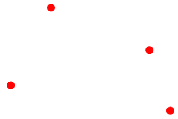
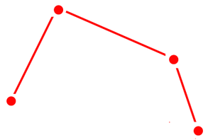
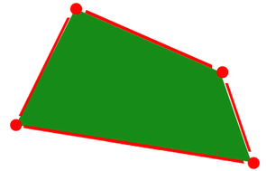
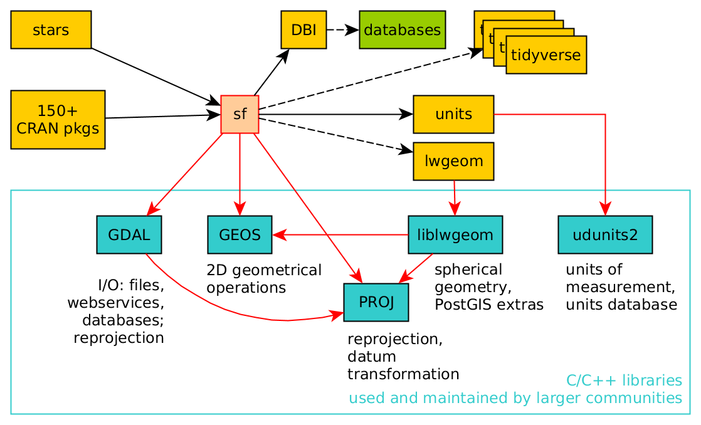

# What is spatial data?

Spatial data is data associated with specific geographical locations — but more than that, it is data where those locations *matter* for the purposes of what we want to do with it.

A table of fish lengths collected at sea is just a table until you ask: where were they caught? Are catches higher in certain areas? How does distribution shift with season? The moment location becomes relevant to your question, you are working with spatial data.

We typically distinguish between two components:

- **Geometry** (or "shape"): the geographic location(s) themselves — coordinates, boundaries, tracks.
- **Attributes**: the data associated with those locations — species, abundance, temperature, depth.

::: {.callout-note}
## Think about it
Consider data collected during a bottom trawl survey. What would be the geometry? What would be the attributes? Could the same data serve as geometry in one analysis and attributes in another?
:::

In marine and fisheries science, spatial data appear constantly: species distribution maps, trawl tracks, fishing effort grids, oceanographic model output, habitat polygons, EEZ boundaries. Getting comfortable with spatial data in R will make all of these more tractable.

---

# Geographic information systems (GIS)

When people think of analysing spatial data, they often think of Geographic Information Systems (GIS) — specialised software for the management, analysis and display of spatial data.

The dominant commercial platform is **ArcGIS** (ESRI), which is widely used in government and industry but is proprietary and expensive. On the open-source side, **QGIS** (<https://www.qgis.org>) and **GRASS** (<https://grass.osgeo.org>) provide powerful alternatives at no cost, and both are worth knowing about.

The limitation of traditional GIS is that they are primarily graphical (point-and-click) tools. This makes ad-hoc exploration easy, but it discourages reproducibility: if you can't write down exactly what you did, someone else (or future you) can't repeat it. R addresses this directly.

---

# Why use R for spatial analysis?

R has become a fully capable environment for spatial analysis and mapping, with mature support for:

- Reading, writing and manipulating spatial data in dozens of formats.
- Spatial operations: selections, overlays, buffers, clipping, joins.
- Coordinate reference systems and reprojection.
- Raster analysis and processing.
- Sophisticated spatial statistics (e.g. geostatistics, geographically weighted regression, spatial autocorrelation).
- High-quality maps for publication, and interactive web maps.

Crucially, R integrates spatial work with the rest of a typical analysis pipeline — data wrangling, statistical modelling, and visualisation all in one reproducible script or document (like this one, written in Quarto).

---

# Spatial data models

Spatial phenomena can be thought of in two fundamental ways:

1. As **discrete objects** with clear boundaries: a fish survey station, a vessel track, an EEZ boundary, a marine protected area.
2. As **continuous fields** without clear boundaries: sea surface temperature, bottom depth, current speed.

These two ways of thinking lead to two distinct data models.

---

## Vector data model

Vector data represents discrete objects using **points**, **lines**, and **polygons**. In all cases, the geometry is made up of coordinate pairs (x, y), and usually additional attributes are attached.

### Points

Points are the simplest vector type. Each point has a location (one coordinate pair) and can have any number of associated attributes.

Examples in fisheries/marine science: trawl station positions, whale sighting locations, CTD cast positions, vessel AIS pings.

Multiple points can be grouped into a single **MULTIPOINT** geometry — for example, all stations in a survey represented as a single feature.

{width=25%}

### Lines

Lines are sequences of points connected by straight segments, in a specific order.

Examples: vessel tracks, river networks, depth contour lines, cable routes.

Multiple line segments can be grouped into a **MULTILINESTRING** geometry (e.g. a branching river system, or a vessel track interrupted by port calls).

{width=25%}

Networks are a special class of line geometry where additional information is stored about how lines connect at nodes (e.g. flow direction, capacity). We will not cover networks in this course.

### Polygons

Polygons are closed rings: a sequence of points where the last coordinate coincides with the first. They represent areas.

Examples: EEZ boundaries, ICES rectangles, marine protected areas, habitat zones, Nephrops functional units.

Polygons can have **holes** (e.g. an island within a lake). They can be grouped into **MULTIPOLYGON** geometries (e.g. a country with many islands, or a fishing area with exclusion zones).

A key rule: valid polygons do not self-intersect.

{width=25%}

---

## Raster data model

Raster data represents continuous fields by dividing space into a regular grid of equally-sized rectangles, called **cells** or **pixels**. Each cell holds one or more values.

{width=50%}

The raster does not store the coordinates of every cell explicitly. Instead, the grid is defined implicitly by three things: the **spatial extent** (overall bounding box), the **resolution** (cell size), and the **origin** (coordinates of the corner). This makes rasters very memory-efficient for large continuous datasets.

{width=50%}

Raster data can be continuous (e.g. depth, temperature, current speed, chlorophyll concentration) or categorical (e.g. substrate type, habitat class). Satellite imagery, oceanographic model output, and interpolated survey grids are all typically stored as rasters.

Multi-layer rasters (sometimes called **raster stacks** or **data cubes**) store multiple variables or time steps in the same grid — for example, monthly sea surface temperature across a year.

Although regular grids are most common, the raster concept extends to rotated, sheared, and curvilinear grids, which appear in some oceanographic model outputs. The **stars** package (discussed below) handles these more flexible grid types.

Other representations of continuous data exist — triangulated irregular networks (TINs) and point clouds, for example — but we will not cover these in this course.

---

## Common spatial file formats

| Format | Type | Notes |
|---|---|---|
| Shapefile (`.shp` + others) | Vector | Very common but outdated; multiple files required; column name limits |
| GeoPackage (`.gpkg`) | Vector (and raster) | Modern open standard; single file; preferred over shapefile |
| GeoJSON (`.geojson`) | Vector | Human-readable; widely used in web mapping |
| GeoTIFF (`.tif`) | Raster | Standard format for raster data; supports CRS metadata |
| Cloud-Optimized GeoTIFF (COG) | Raster | GeoTIFF structured for efficient access over the web |
| NetCDF (`.nc`) | Raster / datacube | Common in oceanography and climate science |
| CSV (`.csv`) | Points (informal) | Works for point data with lat/lon columns; no geometry standard |

The reading and writing of these formats is covered in detail in the [Reading and writing spatial data](input_output.qmd) chapter.

---

# The R ecosystem for spatial data

R's capabilities for spatial analysis have grown substantially over the past two decades, and the ecosystem has gone through one major transition. Here is a brief history, followed by practical guidance on what to use today.

## A brief history

In the early 2000s, several R packages handled spatial data, but each defined its own data structures. There was no common language.

In **2005**, the **sp** package introduced a unified set of classes for vector spatial data (`SpatialPoints`, `SpatialLines`, `SpatialPolygons`, etc.), accompanied by **rgdal** for reading/writing data and **rgeos** for geometric operations. The **raster** package (2010) added solid raster support. This **sp / rgdal / rgeos / raster** ecosystem made R genuinely powerful for spatial work, and hundreds of packages were built on top of it.

However, sp pre-dated the *simple feature access* open standard, didn't integrate well with the tidyverse, and required multiple packages for what should be a coherent workflow.

In **2016**, the **sf** package introduced a new class for vector data built directly on the simple feature standard, integrated with GDAL and GEOS, and designed to work naturally with tidyverse tools like dplyr and ggplot2. It effectively replaced sp, rgdal, and rgeos in one package.

In **2020**, the **terra** package was released as a modern, fast replacement for raster, with a cleaner API and better performance.

::: {.callout-important}
## What to use today
**Use `sf` for vector data and `terra` for raster data.** These are the current standard tools. The older `sp` and `raster` packages still work and you will encounter them in existing code and some packages that have not yet migrated, but you should not start new work with them.
:::

## The current ecosystem

| Task | Package | Notes |
|---|---|---|
| Vector data | **sf** | The standard; integrates with tidyverse |
| Raster data | **terra** | Replaced **raster**; faster and more capable |
| Spatiotemporal data cubes | **stars** | Flexible raster/datacube model; works with sf |
| Interactive maps | **leaflet**, **mapview** | JavaScript-based web maps from R |
| Static maps | **ggplot2** + `geom_sf()` | Vector maps; integrates with sf |

The diagram below shows how these packages relate to each other and to the external libraries (GDAL, GEOS, PROJ) that do much of the underlying work:

{width=100%}

## What about sp and raster?

You will encounter `sp` and `raster` in older code, Stack Overflow answers, and packages that haven't been updated. It's worth knowing they exist. Conversion between `sf` and `sp` is straightforward (`st_as_sf()` and `as(obj, "Spatial")`), and between `terra` and `raster` similarly so. But for any new analysis, start with `sf` and `terra`.

Note that `rgdal` and `rgeos` were formally retired from CRAN at the end of 2023. Code that depends on them will no longer install cleanly on current R versions.

---

# Further reading

- [Geocomputation with R](https://r.geocompx.org/) — a free, comprehensive online book covering sf, terra, and spatial analysis in R. The most useful single reference for this course.
- [Spatial Data Science with R and terra](https://rspatial.org/) — documentation and tutorials focused on terra.
- [CRAN Task View: Analysis of Spatial Data](https://cran.r-project.org/web/views/Spatial.html) — a curated list of spatial packages in R.
